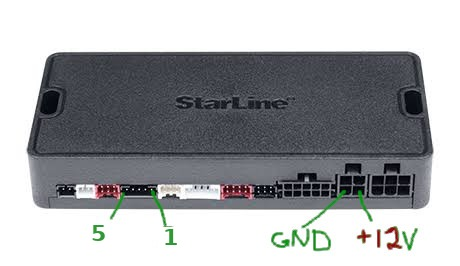

# starline-master-coalesce

LD_PRELOAD-прослойка, которая чинит прошивку блоков StarLine через переходник
**CP2102** в **StarLine Master для Linux**.

[English below](#english)

## Проблема

StarLine Master (проверено на 3.10.5 и 3.11.4, linux64) при прошивке переводит блок
в загрузчик и ждёт от него баннер вида `SA04-U3 2024/01/31 08:58:22\r\n\0\x06`.
Разбор `WintecBootloaderProtocol::decodeGetInfo` показывает, что Мастер требует
**все 31 байт баннера в одном вызове `read()`** и не накапливает данные между вызовами.
Драйвер `cp210x` в Linux отдаёт баннер кусками по 1–8 байт, поэтому Мастер видит
обрезанный ответ (`decodeGetInfo: Get info not full` в логе) и показывает:

> Не удалось переключить режим, убедитесь, что подали 12 В

Под Windows драйвер Silicon Labs буферизует приём, и проблема не проявляется.

## Решение

`coalesce_read.so` перехватывает `read()` на `/dev/ttyUSB*` и `/dev/ttyACM*`:
после первых принятых байтов ждёт паузу в линии (по умолчанию 8 мс, потолок 120 мс)
и досыпает всё, что пришло за это время, в тот же буфер. Для остальных дескрипторов
поведение не меняется.

Проверено 27.09.2026: A93 v2 (SA04) прошит U3 → U8 через самодельный CP2102-переходник.

## Установка

Arch Linux — готовый пакет из [Releases](https://github.com/fedor35/starline-master-coalesce/releases)
(собирается GitHub Actions на каждый тег):

```sh
sudo pacman -U https://github.com/fedor35/starline-master-coalesce/releases/latest/download/starline-master-coalesce-1.0.1-1-x86_64.pkg.tar.zst
```

Или собрать самому из PKGBUILD:

```sh
git clone https://github.com/fedor35/starline-master-coalesce && cd starline-master-coalesce/arch && makepkg -si
```

Вручную:

```sh
make
sudo make install        # PREFIX=/usr по умолчанию
```

Сам StarLine Master в пакет не входит: скачайте linux64-сборку с apps.starline.ru
и распакуйте в `~/starline-master` (или укажите путь в `STARLINE_MASTER`).

## Использование

```sh
starline-master-coalesce
```

Обёртка находит Мастер (`$STARLINE_MASTER`, `~/starline-master`, `/opt/starline-master`),
добивает висящий процесс `StarLine-Master`, который держит порт после закрытия окна,
и запускает `StarLine-Master.sh` с `LD_PRELOAD`.

Переменные окружения прослойки:

| Переменная         | По умолчанию | Смысл                                     |
|--------------------|--------------|-------------------------------------------|
| `COALESCE_GAP_MS`  | 8            | пауза в линии, завершающая пакет          |
| `COALESCE_MAX_MS`  | 120          | максимальное удержание одного `read()`    |
| `COALESCE_DEBUG`   | 0            | 1 — печатать размер каждого чтения в stderr |

## Как прошивать A93 v2 через CP2102



Разъём X8 (приёмопередатчик), нумерация пинов как на фото:

| Пин X8 | Назначение              | Подключение                                             |
|:------:|-------------------------|---------------------------------------------------------|
| 1      | BOOT                    | ⏚ перемычка 1 → 3 (на GND) на всю сессию прошивки       |
| 2      | +12 В (питание антенны) | ✗ **не подключать**                                     |
| 3      | GND                     | GND адаптера + второй конец перемычки с пина 1          |
| 4      | RX блока                | TXD адаптера                                            |
| 5      | TX блока (+5 В в покое) | RXD адаптера                                            |

Разъём X2 (питание): пин 1 — +12 В, пин 2 — масса.

Порядок:

1. Подать питание на X2.
2. Подключить адаптер к X8: GND, TXD, RXD (пины 3, 4, 5) и поставить перемычку 1 → 3.
   Пин BOOT читается только при сбросе; Мастер сам переключает блок между загрузчиком и приложением,
   перемычку держать всю сессию.
3. `starline-master-coalesce`, порт `/dev/ttyUSB0`, «Обновить прошивку».
4. После прошивки снять перемычку, передёрнуть питание, восстановить настройки из `.slc`.

Прослойка решает только проблему сборки баннера. Она не заменяет штатный
программатор и не снимает риск ошибок при прошивке: делайте резервную копию настроек.

---

## English

An `LD_PRELOAD` shim that makes **StarLine Master for Linux** able to flash StarLine
alarm units through a plain **CP2102** USB-UART adapter.

Master's `WintecBootloaderProtocol::decodeGetInfo` expects the 31-byte bootloader
banner in a **single `read()`**. The Linux `cp210x` driver delivers it in 1–8 byte
chunks, so Master reports "Failed to switch mode, check 12 V supply". The shim
intercepts `read()` on `/dev/ttyUSB*` / `/dev/ttyACM*`, waits for a short silence gap
(`COALESCE_GAP_MS`, 8 ms; cap `COALESCE_MAX_MS`, 120 ms) and returns the whole burst.

Install the prebuilt package from GitHub Releases (`pacman -U <url>`), build it with `makepkg -si` from `arch/`, or `make && sudo make install`, unpack the
linux64 Master build into `~/starline-master` (or set `STARLINE_MASTER`), then run
`starline-master-coalesce`. Verified on A93 v2 (SA04), U3 → U8, 2026-09-27.
